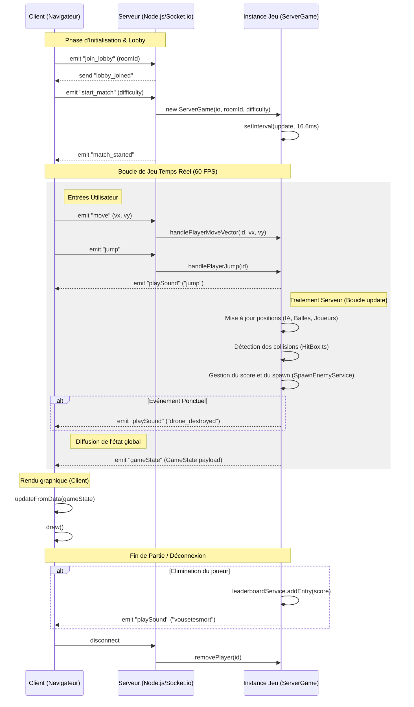

# Shootlevia

Shootlevia est une application de jeu de type shoot-'em-up multijoueur synchrone développée avec TypeScript. L'architecture repose sur une communication en temps réel via Socket.io, permettant une interaction fluide entre plusieurs clients dans un environnement physique géré par le serveur.

## Installation et Lancement

### Prérequis

- Node.js (Version 18 ou supérieure)
- npm (Gestionnaire de paquets)

### Procédure d'installation

```bash
npm install
```

### Exécution de l'application

Le projet nécessite l'exécution simultanée des composants serveur et client.

```bash
# Lancement du serveur (Port par défaut : 8080)
npm run server

# Lancement du client (Port par défaut : 8000)
npm run client:start
```

### Validation technique

```bash
npm run test
```

## Architecture du Système

- client/ : Interface utilisateur et moteur de rendu (Vite, TypeScript, Socket.io-client).
- server/ : Logique métier, autorité serveur et gestion de l'état global (Express, Socket.io).
- common/ : Modules partagés incluant les définitions de types, la gestion des collisions et les constantes globales.
- docker-compose.yml : Configuration pour l'orchestration des conteneurs.

## Flux de communication (WebSockets)

Le diagramme suivant détaille les interactions entre les clients et l'instance de jeu sur le serveur.



## Défis techniques et Solutions implémentées

### 1. Synchronisation de l'état global à 60 Hz

La problématique majeure résidait dans le maintien de la cohérence entre l'autorité du serveur et le rendu fluide côté client.
Solution : Implémentation d'une boucle de mise à jour cadencée à 16,6ms sur le serveur. Le client transmet des vecteurs de vitesse plutôt que des positions absolues, permettant au serveur de valider la physique et de redistribuer l'état global sans saccades.

### 2. Algorithmes de déplacement et Inertie

L'intégration de deux modes de contrôle (clavier ZQSD et suivi de souris) exigeait une réponse physique uniforme.
Solution : Découplage de la capture d'input et de l'application de la force. Une logique d'accélération et de friction a été centralisée pour garantir que l'inertie reste constante, quel que soit le périphérique d'entrée.

### 3. Mécanique de réanimation multijoueur

La gestion des états Vivant et Spectateur devait permettre une transition dynamique sans interrompre la session.
Solution : Mise en place d'un système de proximité. Lorsqu'un joueur actif se situe dans le rayon d'un joueur éliminé, une jauge de progression est incrémentée sur le serveur jusqu'à la réanimation complète du sujet.

## Axes d'amélioration

- Optimisation réseau : Introduction de la prédiction côté client (Client-side Prediction) pour masquer la latence.
- Diversification du Gameplay : Implémentation de patterns de tirs complexes pour les entités ennemies et ajout de boss.
- Persistance des données : Migration du stockage JSON vers une base de données relationnelle pour la gestion du classement.
- Interface de navigation : Développement d'un explorateur de salons publics.

## Analyse des accomplissements

La réussite majeure de ce projet réside dans la robustesse de l'infrastructure multijoueur. Les tests en conditions réelles ont permis de valider la stabilité du système lors de sessions impliquant jusqu'à 12 joueurs simultanés, confirmant ainsi la viabilité de l'architecture choisie. La capacité à orchestrer des sessions privées via des identifiants uniques, tout en assurant une synchronisation temps réel de multiples entités, constitue une base solide pour des développements ultérieurs. L'adaptation dynamique du moteur de rendu aux différentes résolutions d'écran assure une expérience utilisateur cohérente sans distorsion des collisions logiques.

## Ce dont nous sommes le plus fier

- Nous sommes content que les joueurs en multijoueur puisse réanimer leurs alliées.
- Le combat avec le boss (Bus Relais)
