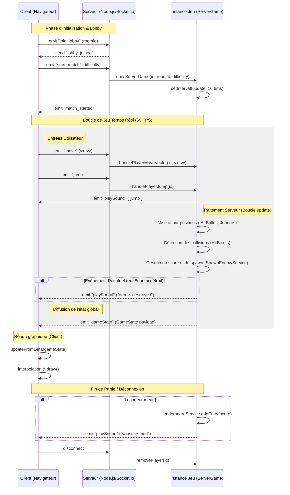

# Diagramme de Séquence

##

```mermaid
sequenceDiagram
    participant C as Client (Navigateur)
    participant S as Serveur (Node.js/Socket.io)
    participant G as Instance Jeu (ServerGame)
    Note over C, S: Phase d'Initialisation & Lobby
    C ->> S: emit "join_lobby" (roomId)
    S -->> C: send "lobby_joined"
    C ->> S: emit "start_match" (difficulty)
    S ->> G: new ServerGame(io, roomId, difficulty)
    G ->> G: setInterval(update, 16.6ms)
    S -->> C: emit "match_started"
    Note over C, G: Boucle de Jeu Temps Réel (60 FPS)

    rect rgb(240, 240, 240)
        Note right of C: Entrées Utilisateur
        C ->> S: emit "move" (vx, vy)
        S ->> G: handlePlayerMoveVector(id, vx, vy)
        C ->> S: emit "jump"
        S ->> G: handlePlayerJump(id)
        G -->> C: emit "playSound" ("jump")
        Note right of G: Traitement Serveur (Boucle update)
        G ->> G: Mise à jour positions (IA, Balles, Joueurs)
        G ->> G: Détection des collisions (HitBox.ts)
        G ->> G: Gestion du score et du spawn (SpawnEnemyService)

        alt Événement Ponctuel (ex: Ennemi détruit)
            G -->> C: emit "playSound" ("drone_destroyed")
        end

        Note left of S: Diffusion de l'état global
        G -->> C: emit "gameState" (GameState payload)
    end

    Note over C: Rendu graphique (Client)
    C ->> C: updateFromData(gameState)
    C ->> C: interpolation & draw()
    Note over C, G: Fin de Partie / Déconnexion
    alt Le joueur meurt
        G ->> G: leaderboardService.addEntry(score)
        G -->> C: emit "playSound" ("vousetesmort")
    end

    C ->> S: disconnect
    S ->> G: removePlayer(id)

```
